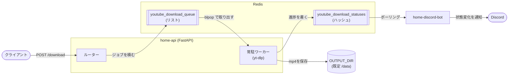

# home-api

YouTubeの動画をダウンロードするためのFastAPI製REST API。

URLを受け取ってRedisのキューへ積み、常駐ワーカーが yt-dlp でmp4としてダウンロードする。タスクの進捗はRedis上のハッシュに書き込まれ、通知ボット [`ssmc-network/home-discord-bot`](https://github.com/ssmc-network/home-discord-bot) がそれを読んでDiscordへ通知する。

## 構成



- `POST /download` はキューへ積むだけで、ダウンロードには関与しない
- ダウンロードはアプリ起動時に立ち上がる**常駐ワーカー**が行う。ワーカーの本数(`DOWNLOAD_WORKERS`、既定1)がそのまま同時ダウンロード数の上限になる
- タスクの状態は `queued` → `processing` → `done` / `error` と遷移する

### home-discord-bot との連携

Redisの `youtube_download_statuses` ハッシュが唯一の連携点であり、実質的なプロセス間の契約になっている。値は `{"status": ..., "error": ..., "title": ...}` というJSON文字列。

**このスキーマを変更する場合は必ずボット側と同時に更新すること。** 片方だけ変えると通知が壊れる。

## エンドポイント

| メソッド | パス | 説明 |
| --- | --- | --- |
| `POST` | `/download` | `{"url": "..."}` を受け取りキューへ登録、`task_id` を返す |
| `GET` | `/download/status` | 全タスクの状態を返す |
| `DELETE` | `/download/all` | 全タスクの状態と未処理のキューを削除する |
| `GET` | `/operation` | 疎通確認 |
| `GET` | `/operation/ip` | ホスト名とIPを返す |
| `GET` | `/operation/gzip-test` | gzip確認用の大きめのレスポンス |
| `GET` | `/docs` | Swagger UI(`/` からリダイレクト。ReDocは無効) |

すべてのパスには `PREFIX_URL` が前置される。

## 設定

環境変数で上書きする(pydantic-settings)。すべて任意。

| 環境変数 | 既定値 | 説明 |
| --- | --- | --- |
| `SERVICE` | `home-api` | ログに載るサービス名 |
| `TZ` | `Asia/Tokyo` | ログのタイムスタンプに使うタイムゾーン(composeでも同じ値を指定している) |
| `LOGLEVEL` | `INFO` | ログレベル |
| `PREFIX_URL` | (空) | 全エンドポイントの前置パス |
| `OUTPUT_DIR` | `/data` | 動画の保存先 |
| `DOWNLOAD_WORKERS` | `1` | 常駐ワーカーの本数 = 同時ダウンロード数の上限 |
| `QUEUE_POP_TIMEOUT_SECONDS` | `5` | ワーカーがキューを待つ時間。シャットダウンの最大待ち時間にもなる |
| `QUEUE_ERROR_BACKOFF_SECONDS` | `5` | Redis接続エラー時の再試行間隔 |
| `WORKER_SHUTDOWN_TIMEOUT_SECONDS` | `30` | 停止時に処理中のダウンロードを待つ上限 |
| `REDIS_HOST` | `redis-service` | Redisのホスト |
| `REDIS_PORT` | `6379` | Redisのポート |
| `REDIS_MAX_CONNECTIONS` | `10` | コネクションプールの上限 |

`TITLE` / `DESCRIPTION` / `VERSION` / `OPENAPI_URL` / `DOCS_URL` でOpenAPIの表示も変更できる。

## 開発

依存関係はPoetryで管理し、`dev` ターゲットのDockerコンテナ内で実行する。**ローカルvenvのワークフローは用意していない。**

```bash
# 開発コンテナとRedisを起動
docker compose up -d

# コンテナ内でコマンドを実行
docker compose exec app ruff check .        # Lint
docker compose exec app ruff format .       # フォーマット
docker compose exec app mypy .              # 型チェック
docker compose exec app pytest              # テスト
docker compose exec app pytest --cov --cov-report=term-missing   # カバレッジ付き
```

テストは `app/tests/` 配下。Redisは fakeredis でインメモリに模しているため、テスト実行に実Redisは不要。

## ビルド

```bash
docker build --target prd .          # 本番イメージ
docker compose -f compose.prd.yml up # 本番構成で起動
```

ベースイメージには Docker Hardened Images (`dhi.io/python:3`) を使用している。

**本番イメージは非rootユーザーで動作する。** `OUTPUT_DIR`(既定 `/data`)への書き込みが必要なため、Kubernetes等へデプロイする際は**ボリュームが非rootのUIDから書き込めるようにすること**(`fsGroup` の指定など)。また最小構成イメージのためシェルが入っておらず、コンテナ内での調査は `dev` イメージで行う必要がある。

yt-dlpが映像と音声をmp4へマージするために ffmpeg が必要だが、最小構成イメージにはパッケージマネージャが無いため、静的ビルドのバイナリ(`ffmpeg` / `ffprobe`)をCOPYして同梱している。

## ブランチ運用とリリース

**GitHub Flow。** 長期ブランチは `main` のみ(保護ブランチ)。開発ブランチは `main` から切り、PRで `main` へ直接マージする。

「いつコードが `main` に入るか」と「いつバージョンとして公開するか」は分離している。`main` へのマージ自体はDocker Hubへの公開を伴わない。

| ワークフロー | トリガー | 内容 |
| --- | --- | --- |
| `test.yaml` | `main` へのPR | Lint・フォーマット・テストを `dev` イメージ内で実行し、カバレッジとDocker Scoutの脆弱性スキャン結果をPRコメントへ投稿 |
| `release.yaml` | 手動 | バージョンの検証 → gitタグ作成 → GitHub Release作成 → `build.yaml` の起動(既定は `dry_run=true`) |
| `build.yaml` | `v*.*.*` タグのpush | `prd` イメージを Docker Hub へpush |

公開は `release.yaml` を GitHub Actions の画面から手動実行して行う。

## 公開先

Docker Hub: `ssmcnetwork/home-api`

> **注意**: Organizationへの移管以前は個人アカウント配下の `goegoe0212/home-api` へ公開していた。参照しているKubernetesマニフェスト等がある場合は追従が必要。

## 関連リポジトリ

- [`ssmc-network/home-discord-bot`](https://github.com/ssmc-network/home-discord-bot) — ダウンロードの進捗をDiscordへ通知するボット
